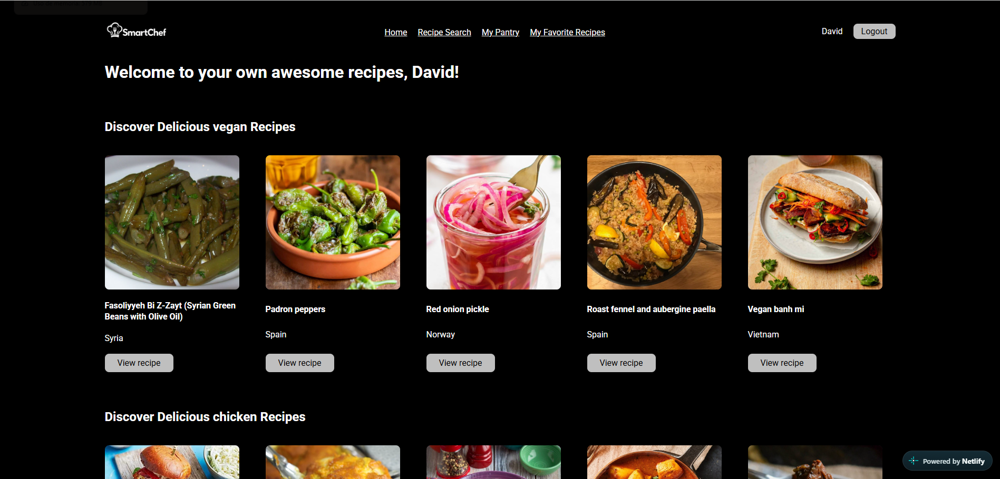
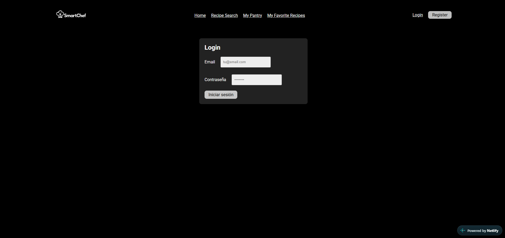
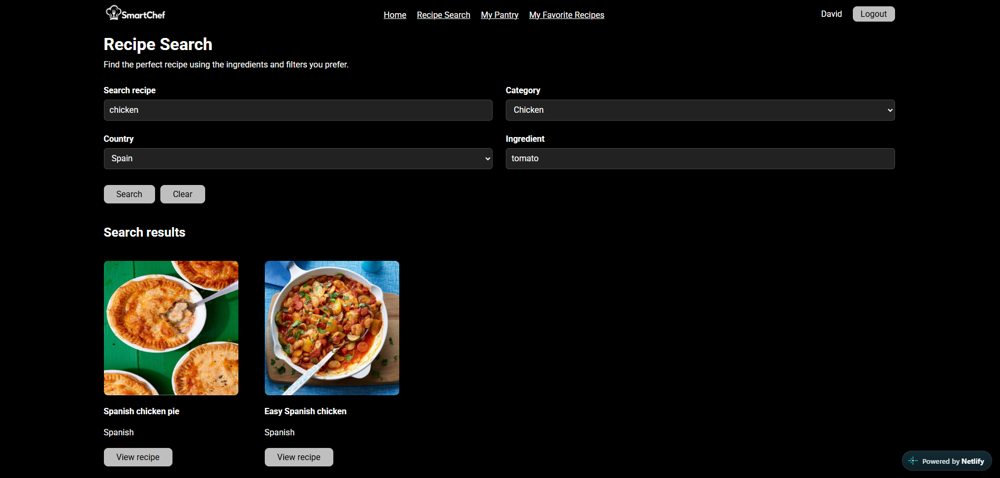
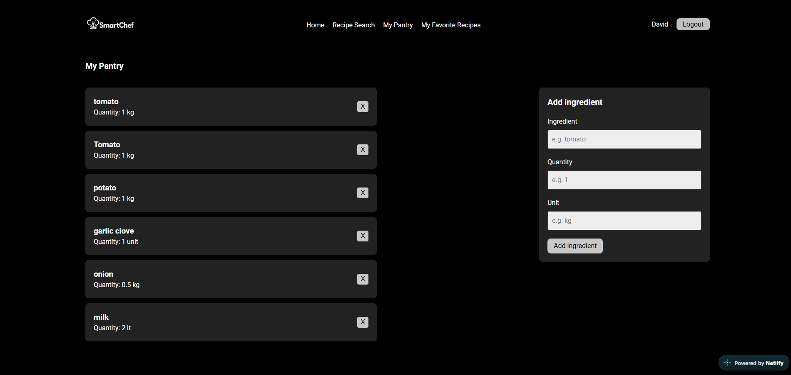
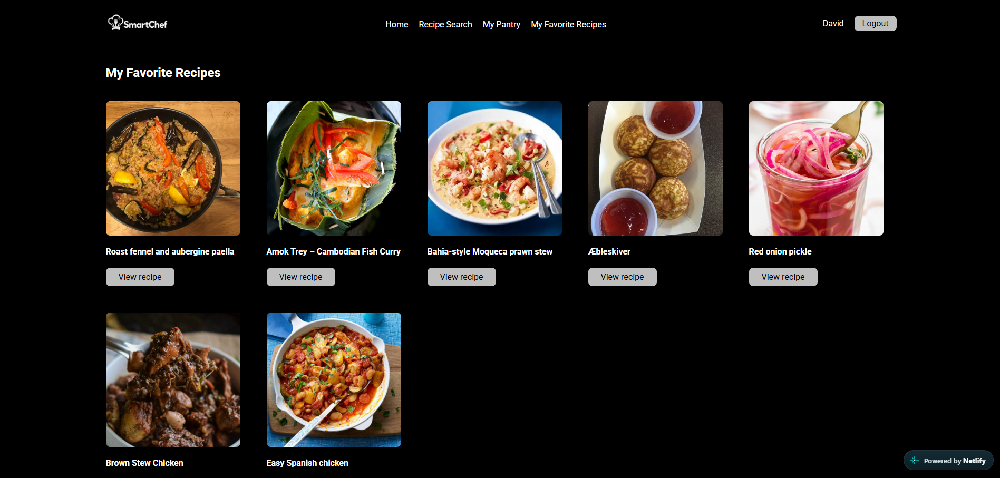
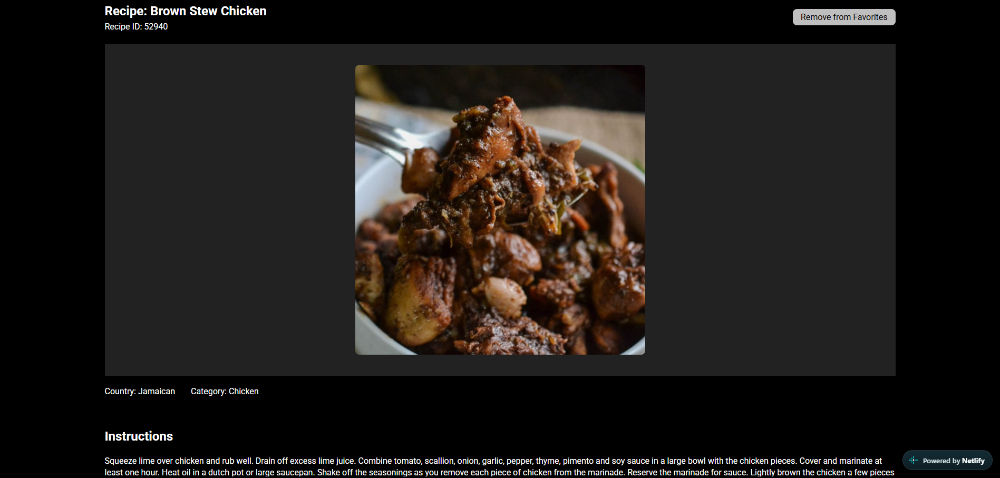
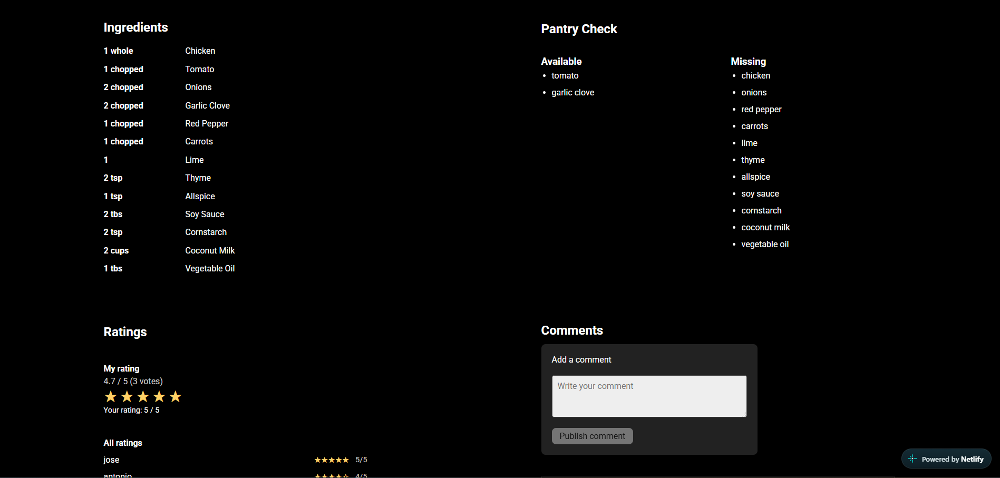
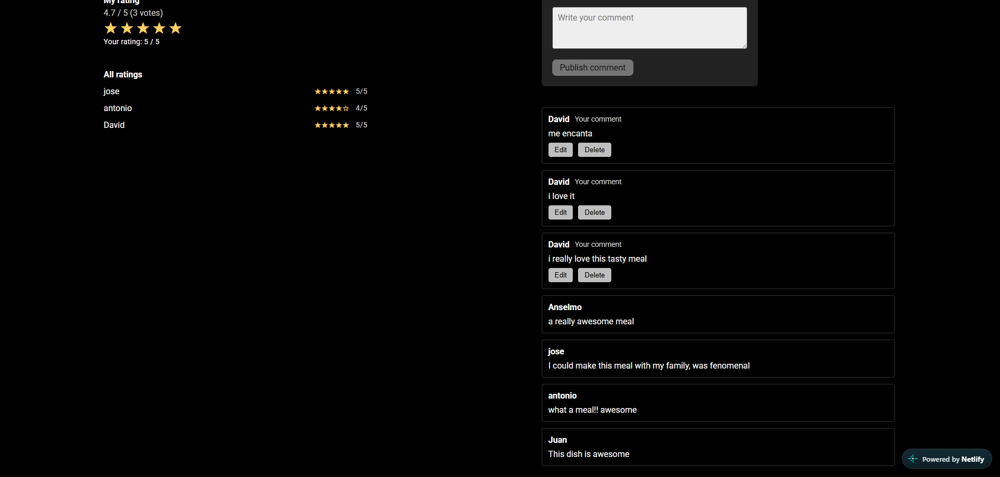

# 🍲 SmartChef

Aplicación web full-stack para la gestión inteligente de la despensa y la búsqueda de recetas. SmartChef te permite guardar los ingredientes que tienes en casa, buscar recetas por nombre, categoría, país de origen o ingrediente, comprobar qué te falta para cocinarlas, y guardar tus favoritas, valorarlas y comentarlas.

## 📸 Capturas de pantalla

| Home | Login |
|---|---|
|  |  |

| Búsqueda de recetas | Mi despensa |
|---|---|
|  |  |

| Mis recetas favoritas | Detalle de receta |
|---|---|
|  |  |

| Detalle de receta (ingredientes) | Detalle de receta (comentarios) |
|---|---|
|  |  |

## ✨ Funcionalidades

- **Autenticación de usuarios**: registro, login y sesión persistente.
- **Mi despensa**: añadir, editar y eliminar los ingredientes que tienes en casa.
- **Búsqueda de recetas**: por texto libre, categoría, país o ingrediente, usando [TheMealDB](https://www.themealdb.com/api.php) como fuente de recetas.
- **Comprobación de despensa**: para cada receta, indica qué ingredientes ya tienes y cuáles te faltan.
- **Favoritos**: guarda recetas para consultarlas más tarde.
- **Valoraciones y comentarios**: puntúa y comenta las recetas.

## 🛠️ Cómo está desarrollado

SmartChef es un monorepo con dos aplicaciones independientes que se comunican por HTTP:

- **`web/`** — Frontend SPA hecho con **React 19** y **Vite**, enrutado con **React Router**, formularios con **React Hook Form** y llamadas a la API con **Axios**. El estilo se gestiona con CSS plano (`index.css`).
- **`api/`** — API REST hecha con **Express 5** y **MongoDB** (vía **Mongoose**). La autenticación usa sesiones (`express-session` + `connect-mongo`) con contraseñas cifradas con **bcryptjs**. El logging usa **pino**. Las recetas no se almacenan en la propia base de datos: se obtienen en tiempo real de la API pública **TheMealDB**, mientras que la despensa, favoritos, valoraciones y comentarios del usuario sí se persisten en MongoDB.
- **Testing**: la API tiene tests con **Jest**, **Supertest** y **mongodb-memory-server** (base de datos en memoria para tests aislados), con datos de ejemplo generados con **@faker-js/faker** (`seeds.js`).
- **Despliegue**: configurado para **Netlify** (`netlify.toml`). El frontend se sirve como sitio estático (`web/dist`) y la API Express se ejecuta como una Netlify Function (`api/netlify/functions/api.js`, envolviendo Express con `serverless-http`), con `/api/*` redirigido a esa función y el resto de rutas servidas por el SPA de React.

## 📂 Estructura del código

```
smartchef/
├── web/                        # Frontend (React + Vite)
│   └── src/
│       ├── pages/              # Una página por ruta (home, login, register,
│       │                       #   recipe-search, recipe-detail, pantry, favorites)
│       ├── components/         # Componentes reutilizables, agrupados por dominio
│       │   ├── auth/           #   formularios de login/registro
│       │   ├── pantry/         #   lista/formulario/item de despensa
│       │   ├── gallery/, favorites-gallery/, favorite-button/
│       │   ├── recipe-detail/, rating/, comments/
│       │   └── ui/             #   componentes de interfaz genéricos (navbar, etc.)
│       ├── layouts/            # Layouts compartidos entre páginas
│       ├── contexts/           # Contexto de autenticación (auth-context)
│       ├── services/           # Cliente Axios centralizado (api-service.js)
│       └── assets/             # Imágenes y recursos estáticos
│
├── api/                        # Backend (Express + MongoDB)
│   ├── src/
│   │   ├── server.js           # Punto de entrada (arranca el servidor HTTP)
│   │   ├── app.js              # Configuración de la app Express (middlewares, rutas)
│   │   ├── controllers/        # Un controlador + rutas por recurso
│   │   │   (users, pantryItems, favorites, recipes, mealCategories, rating, comments)
│   │   ├── middlewares/        # Autenticación (auth.mid) y manejo de errores (errors.mid)
│   │   └── lib/
│   │       ├── models/         # Esquemas de Mongoose (user, pantryItem, favorite,
│   │       │                   #   rating, comments, mealCategory)
│   │       ├── db.js           # Conexión a MongoDB
│   │       ├── session.js      # Configuración de sesión
│   │       ├── cors.js         # Configuración de CORS
│   │       └── config.js       # Configuración/variables de entorno (convict)
│   ├── netlify/functions/api.js# Adaptador serverless de la app Express para Netlify
│   └── seeds.js                # Script para poblar la base de datos con datos de ejemplo
│
├── smartchef-images/           # Capturas de pantalla usadas en este README
├── netlify.toml                # Configuración de build y redirecciones de Netlify
└── doc/                        # Documentación adicional del proyecto
```

## 🚀 Puesta en marcha

**Backend** (`api/`):

```bash
cd api
npm install
npm run dev      # http://localhost:<puerto> con recarga automática
```

**Frontend** (`web/`):

```bash
cd web
npm install
npm run dev       # http://localhost:5173 por defecto
```

Cada carpeta (`web/` y `api/`) gestiona sus propias dependencias y variables de entorno de forma independiente.
